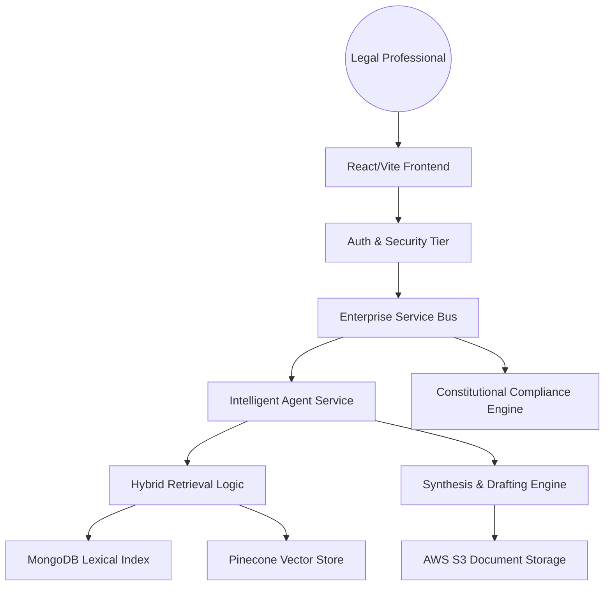
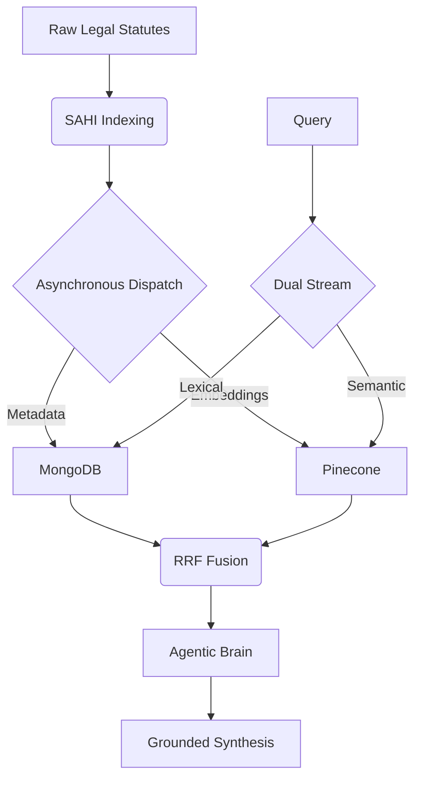

# Legalyze: An Agentic Retrieval-Augmented Generation Framework for Reducing Legal Research and Drafting Latency in Pakistani Jurisdictions

Legalyze is a sovereign, multi-tier agentic framework designed to automate specialized legal research and drafting within the Pakistani judicial system. By leveraging **Structure-Aware Hierarchical Indexing (SAHI)** and **Multi-Modal Hybrid Retrieval (MongoDB + Pinecone)**, the system reduces research latency from hours to minutes while maintaining 100% jurisdictional grounding.

## 🏛️ System Architecture

### 1. Multi-Tier Framework (SOA)
The system is built on a Service-Oriented Architecture (SOA) consisting of five decoupled layers:
- **Client Tier:** React + Vite (Case Buildup Wizard, Chat UI)
- **ESB Tier:** Asynchronous Request Routing & API Gateway
- **Auth Tier:** JWT-based RBAC & Data Sovereignty
- **Intelligent Services:** Agentic Brain (GPT-4o), SAHI Indexer, Constitutional Engine
- **Resource Tier:** MongoDB, Pinecone, AWS S3



### 2. Agentic RAG Data Pipeline
The core intelligence layer utilizes a dual-discovery stream with Reciprocal Rank Fusion (RRF).



## 🚀 Getting Started

### Prerequisites
- Node.js (v18+)
- MongoDB (Local or Atlas)
- Pinecone API Key
- OpenAI API Key

### 1. Installation & Setup

**Clone the Repository:**
```bash
git clone https://github.com/CyberHamza/Legalyzing.git
cd Legalyze-FullStack
```

**Backend Configuration:**
1. Navigate to the backend directory:
   ```bash
   cd backend
   ```
2. Install dependencies:
   ```bash
   npm install
   ```
3. Create a `.env` file from the template:
   ```bash
   # .env Template
   PORT=5000
   MONGODB_URI=your_mongodb_connection_string
   JWT_SECRET=your_jwt_secret
   OPENAI_API_KEY=your_openai_key
   PINECONE_API_KEY=your_pinecone_key
   PINECONE_ENVIRONMENT=your_pinecone_env
   AWS_ACCESS_KEY_ID=your_aws_key
   AWS_SECRET_ACCESS_KEY=your_aws_secret
   S3_BUCKET_NAME=your_bucket
   ```

**Frontend Configuration:**
1. Navigate to the frontend directory:
   ```bash
   cd ../Legalyzing
   ```
2. Install dependencies:
   ```bash
   npm install
   ```
3. Update `src/config.js` or `.env` with your Backend API URL.

### 2. Running the Project

**Start Backend (Dev Mode):**
```bash
cd backend
npm run dev
```

**Start Frontend:**
```bash
cd ../Legalyzing
npm run dev
```

The application will be accessible at `http://localhost:5173`.

## ⚖️ Features
- **Case Buildup Wizard:** Interactive step-by-step drafting for petitions.
- **Constitutional Compliance:** Automatic Article-to-Fact violation detection.
- **Hybrid Search:** Combines legal citations (lexical) with case intent (semantic).
- **Deep Metadata Extraction:** Automated identification of court tiers and timelines.

## 📑 Acknowledgments
Developed at the **Military College of Signals (MCS), National University of Sciences and Technology (NUST)**, Pakistan. 

---
*Note: This repository contains the framework code. Legal statutes and private case data are managed via the sovereign local indexing service.*
